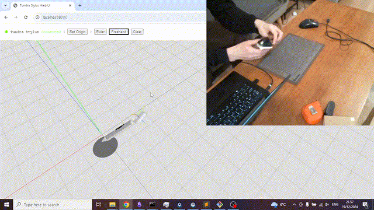
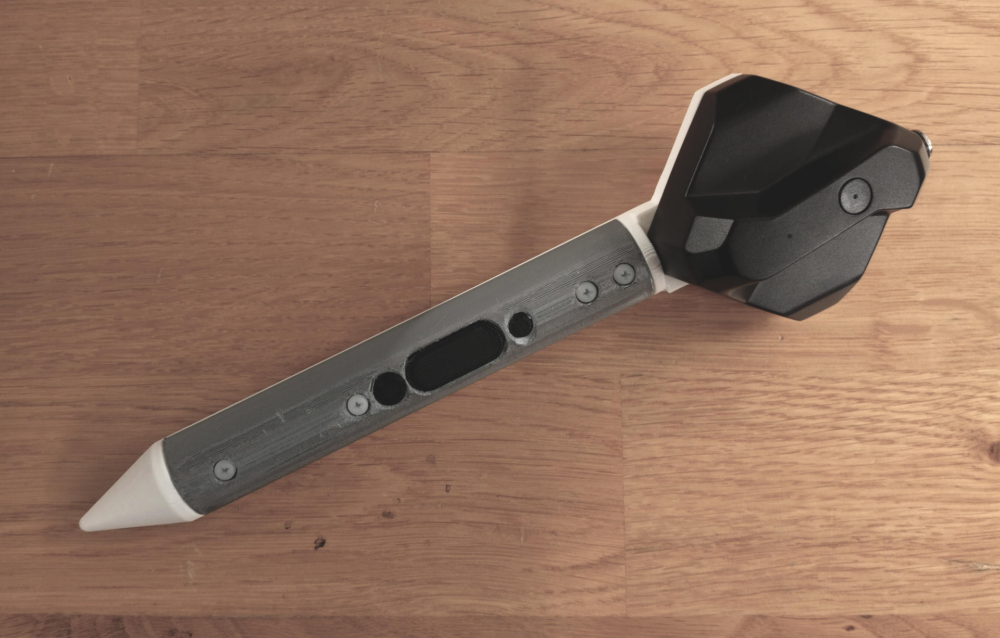

# Tundra Stylus

Tundra Tracker stylus baseplate for 3D positional tracking. This repository contains design files and test application source code.

## Introduction

Vive Lighthouse system is great! The main use of it is VR, but what about drawing or painting in space? Stylus input is the natural choice of many, but there is no VIVE Lighthouse Stylus available. Logitech almost launched VR Ink, but then decided not to. What to do?

Tundra Tracker is the smallest available off-the-shelve tracker that is compatible with the VIVE Lighthouse system. It offers a great deal of flexibility via its IO Expansion Board. With that in mind, all we need is a neat circuit board with buttons and a 3D-printable structure that looks and feels like a stylus. 

And that is Tundra Stylus! Produce the circuit board, 3D print the enclosure and you are ready to go, given that you have the Tundra Tracker and its IO Expansion board.

## Replicating

Here is a table of contents of different documentation sections that will tell you what to do. You can also jump right to the design, electronics and software sections if you know all that by heart and prefer not to read too much documentation. It is up to you.

- [BOM](docs/BOM.md)  
  Sstart here as you will need to purchase some things to get started.
- [PCB Production](docs/PCB_PRODUCTION.md)  
  This may take time too so better start early.
- [3D Printing](docs/3D_PRINTING.md)  
  This one is relatively fast, given you have FDM printer available.
- [Assembly](docs/ASSEMBLY.md)  
  Putting it all together should be not hard, given you have all the parts (and tools).
- [Usage](docs/USAGE.md)  
  The setup and software part of the process.
- [Contributing](docs/CONTRIBUTING.md)  
  You are willing to improve something? Great!

## License

This project is licensed under the MIT License for non-commercial and research purposes. For commercial use, please contact the repository author separately for licensing terms.

