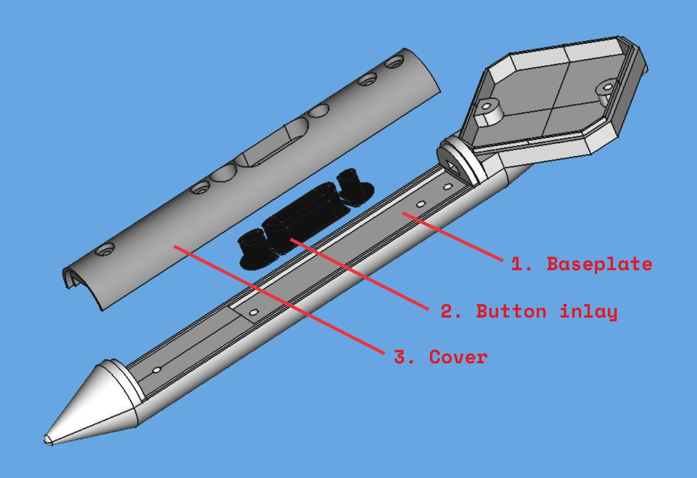
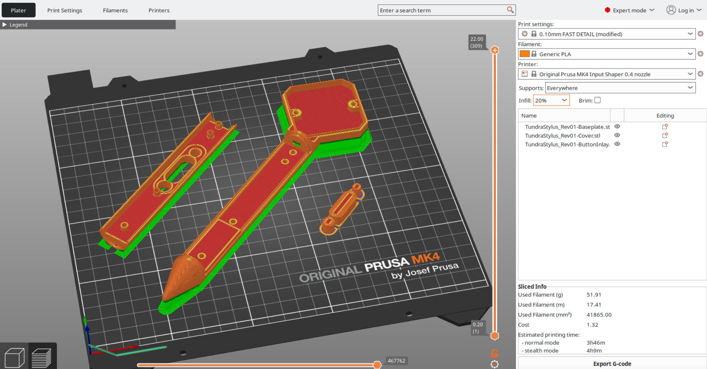

# 3D Printing

There are three parts to be 3D printed.

1. The main stylus baseplate
2. Button inlay
3. Cover

3D models for all of them can be found in the [design/3dprint](../design/3dprint) directory. 

Prusa MK4 3D printers with PLA filament were used to print the parts. The models were sliced using the default 0.10mm FAST DETAIL preset with 20% infill and 0.4mm nozzle Input Shaper printer profile.

The baseplate and cover were printed inside-up to maintain precision in the inner part of thde design.

After printing, supports were removed and the surfaces processed with sanding paper. For better appearance, one could use medium-viscosity two-component epoxy glue, optional sanding, and spraypaint of your choice. 