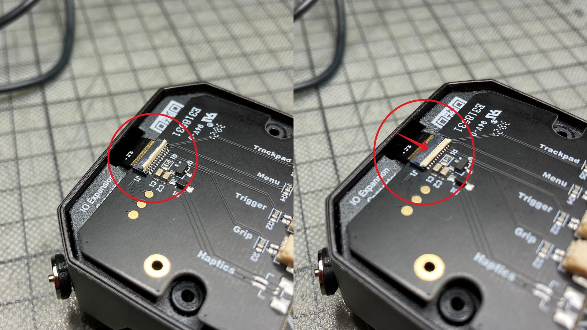
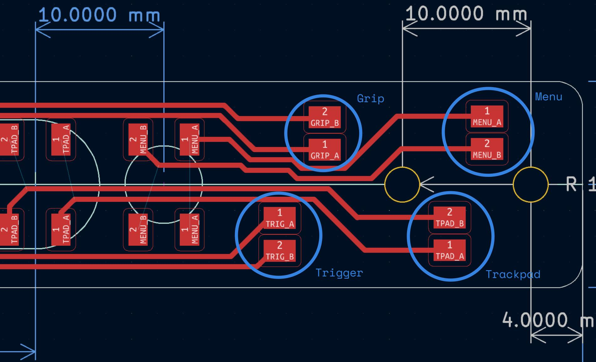

# Assembly

Given that you have soldered the tactile switches to the button PCB and processed the 3D printed parts, you are ready to proceed with the assembly process.

You will need to shorten the cables that come with the Tundra Tracker IO Expansion Board. To do that, start with connecting the cables to the expansion board. Then, open up the Tundra Tracker and insert the IO board like so.

There are the 2x Torx T5 Thread Forming M1.6 screws missing in the image. I lost them somewhere, that is why they are not there. 

> The flat cable connector on the right has a lock mechanism. Make sure you insert the cable properly and then use a small instrument, such as tweezers, to lock it.

Use paper tape and label the cables as you won't be able to trace them back to the connectors on the IO board once you attach the Tundra Tracker to the Baseplate.

Then, attach the Tundra Tracker to the stylus Baseplate using the same bolts that were used to attach the original Tundra Tracker baseplate.

Guide the cables through the hole in the back of the stylus baseplate and position the circuit board. Cut the cables one-by-one, strip them, and solder them to the respective pads of the buttons. 

Finally, use the 4x Nylon bits and bolts to keep the cover in place. Press the hexagonal nylon nuts in their respective pockets on the outer wall of the stylus baseplate, insert the button inlay in the cover and close the whole structure. Use a screwdriver to fasten the 20mm bolts.

At this point, you can move on to testing and using the stylus.