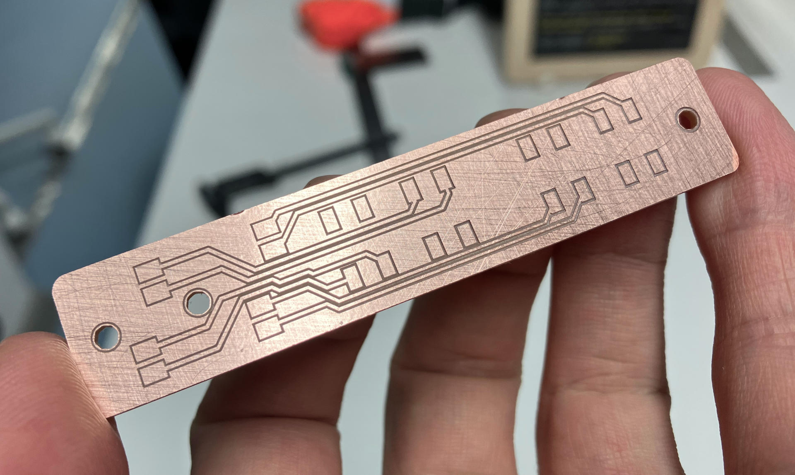
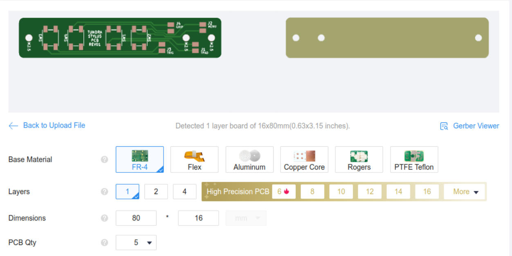

# PCB Production

An essential component of the Tundra Stylus is its button board with 4 tactile switches. 

There are four cable pairs connecting the pads on the board with the Tundra Stylus IO Expansion board that is placed under the Tundra Stylus itself.

The cables are connected to the PCB in the following order (starting from the tip of the stylus upward).

1. Trigger
2. Grip
3. Trackpad
4. Menu

The names of the buttons might make you think that some of them can sense pressure, but all of them are plain digital IO buttons. You will need to cut them shorter, but try to leave a bit of extra in case you mess something up.

## Making the Board

There are two ways to make the board.

1. PCB milling
2. Manufacturing online

### PCB Milling

Gerber files for PCB milling process can be found in [electronics/gerbers/milling](../electronics/gerbers/milling) directory. You can use KiCad electronics design software to export Gerber files for manufacturing online. KiCad 7 was used to design the board.

As for the milling process, CopperCAM software was used to calculate toolpaths in HPGL form. Then, Bungard CCD/2 MTC machine was used to mill the board. A 60deg V bit was used for isolation milling and a 0.8mm cylindrical tool was used to cut the holes and outline. FR2 single-sided copper clads from Bungard were used as the base material. 

### Manufacturing Online

Gerber files for manufacturing a single-sided board for JLCPCB is included in [electronics/gerbers/jlcpcb](../electronics/gerbers/jlcpcb). Log into JLCPCB and upload the zip file. It should show up as in the image below. 

Do not forget to order a SMT-Stencil if you want to use solder paste and reflow soldering. 

