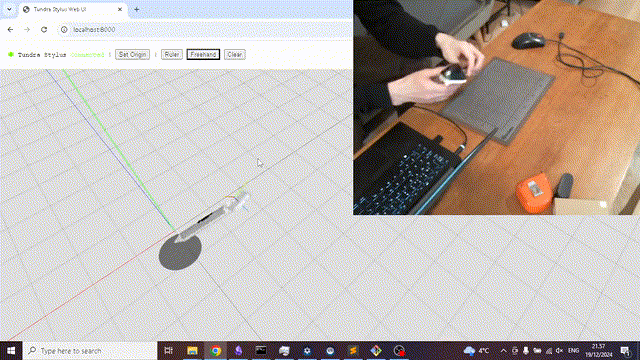

# Usage

Now when you have the Tundra Stylus assembled, it is time to make sure it works. You will need to set up your physical space for that first. Also make sure that your Tundra Tracker is fully charged.

## Setting up Base Stations

Tundra Stylus has been tested with Vive Base Station 2.0. One is enough, but if you want to use two or more, make sure you change the channel for one of them as in order to take advantage of multi-base-station tracking, the base stations should be on different channels. You can do this by using a pin similar to one used to remove SIM from iPhone. There is a little pin-hole on the back of the Vive Base Station, insert the pin there and press until you feel/hear a click. The base station should show up with a different channel in SteamVR now.

It is recommended to set up the base stations higher above head level, in the corners of the room. The field of view of base stations is 120deg. Tilt them a bit downward so that they cover all areas the tracker is going to reside. Also take into account the body position of yours. Set the base stations up in a way so that it is less likely that your body is going to be in the way.

## Testing in SteamVR

Once the base stations are set up, fire up your Steam software and install SteamVR. I was testing it on Windows, and got half-way on Linux, but the main reason for that was the uneven way the null driver behaves on both of the systems. 

I am using the stylus without a headset to drive cursor on screen. In order to be able to use it without headset, you will need to enable the null driver.

First, edit the default Steam VR settings and enable the "null" driver. Open the following file in a text editor and set `"enable"` to `true`.

```
C:\Program Files (x86)\Steam\steamapps\common\SteamVR\drivers\null\resources\settings\default.vrsettings
```

```json
"enable": true
```

Then, proceed to the general SteamVR settings.

```
C:\Program Files (x86)\Steam\steamapps\common\SteamVR\resources\settings\      
default.vrsettings
```

```json
"requireHmd": false,
"forcedDriver": "null",    
"activateMultipleDrivers": true
```

Restart SteamVR and turn on the tracker on the stylus. Make sure the tracker dongle included with Tundra Tracker is plugged into your computer, the VIVE base stations, and the Tundra Tracker are on. Wait for the base stations and tracker icons to show up. 


Next, configure your tracker as a handheld controller.

1. Select the SteamVR menu and go to Settings
2. Select Controllers
3. Select Manage Trackers
4. Set Tracker Role as Held in Hand
5. Set to Any hand (default)


Then open the test controller panel and test the controller.


The circles should appear as filled as soon as you press buttons on the stylus.


On Windows, you should also be able to see the Tundra Tracker floating in space via the VR View.

## Testing with Web UI

Now, that SteamVR can recognize the tracker, we can move on to application-specific adventures. The repository includes middleware, a proxy application that uses OpenVR API to communicate with SteamVR and extracts pose information that can then be passed on to any application on your computer. 

### Proxy

You can find the SteamVR compatible OpenVR proxy in the [software/steamvr](../software/steamvr/) directory. There is a README file that explains prerequisites and launching sequence. 

### Web UI

Once you get it to run, proceed to the Web UI. It is build using threejs 3D library and JavaScript modules. It requires to be launched via a local webserver. Instructions can be found in the [software/webui](../software/webui/) directory.

Open the browser and go to the address you configure your local webserver with. It will take some time for the application to start receiving tracker pose information, thus the "Waiting for Stylus" message will be there for some seconds. Once the tracker starts sending pose information, you can do several things.

1. Use the Menu button to set the origin
2. Use the Mouse to select one of two test tools
    1. Ruler tool
    2. Freehand tool
3. Use the Trigger button to place points in the case of the Ruler tool or start drawing a line with the Freehand tool.



## Creating your Own App

To build your own JavaScript application, you can reuse the `TundaStylus` class that can be found in [software/webui/js](../software/webui/js/TundraStylus.js). It follows a three step initialization.

```
// Step 1: Create sylus manager instance
const stylus = new TundraStylus();

// Step 2: Add listeners
stylus.addEventListener('new_stylus', event => { ... });
stylus.addEventListener('pose',       event => { ... });
stylus.addEventListener('click',      event => { ... });
stylus.addEventListener('pressed',    event => { ... });
stylus.addEventListener('released',   event => { ... });

// Step 3: Connect to WebSocket host
stylus.connect('ws://localhost:8080');
```

The `TundraStylus` class extends the built-in [CustomEvent](https://developer.mozilla.org/en-US/docs/Web/API/CustomEvent/CustomEvent) class. It carries data that can be accessed via `event.detail` member variable.

THe `TundraStylus` can capture and forward data of multiple styluses. As soon as first message with a specific controller ID is received, a `new_stylus` event is emited. 

The `new_stylus` event carries the ID of the newly added stylus.

```
{
    id: 1
}
```

The `pose` event carries the raw pose of the tracker, as well as the calculated tip position as `event.detail.position`.

```
{
    id,
    position,
    tracker: {
        pose,
        position,
        quaternion
    }
}
```

The `click`, `pressed` and `released` events also have a `buttonName` variable that can be one of four values: `trig`, `menu`, `grip` or `tpad`. 

```
{
    id,
    buttonName: "trig | menu | grip | tpad",
    position,
    tracker: {
        pose,
        position,
        quaternion
    }
}
```
